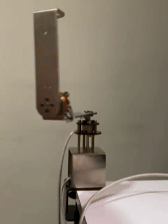
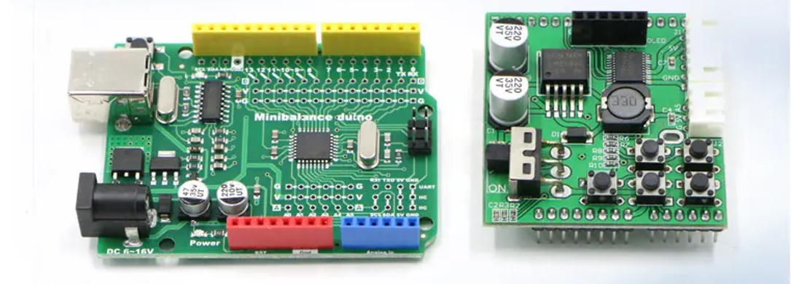
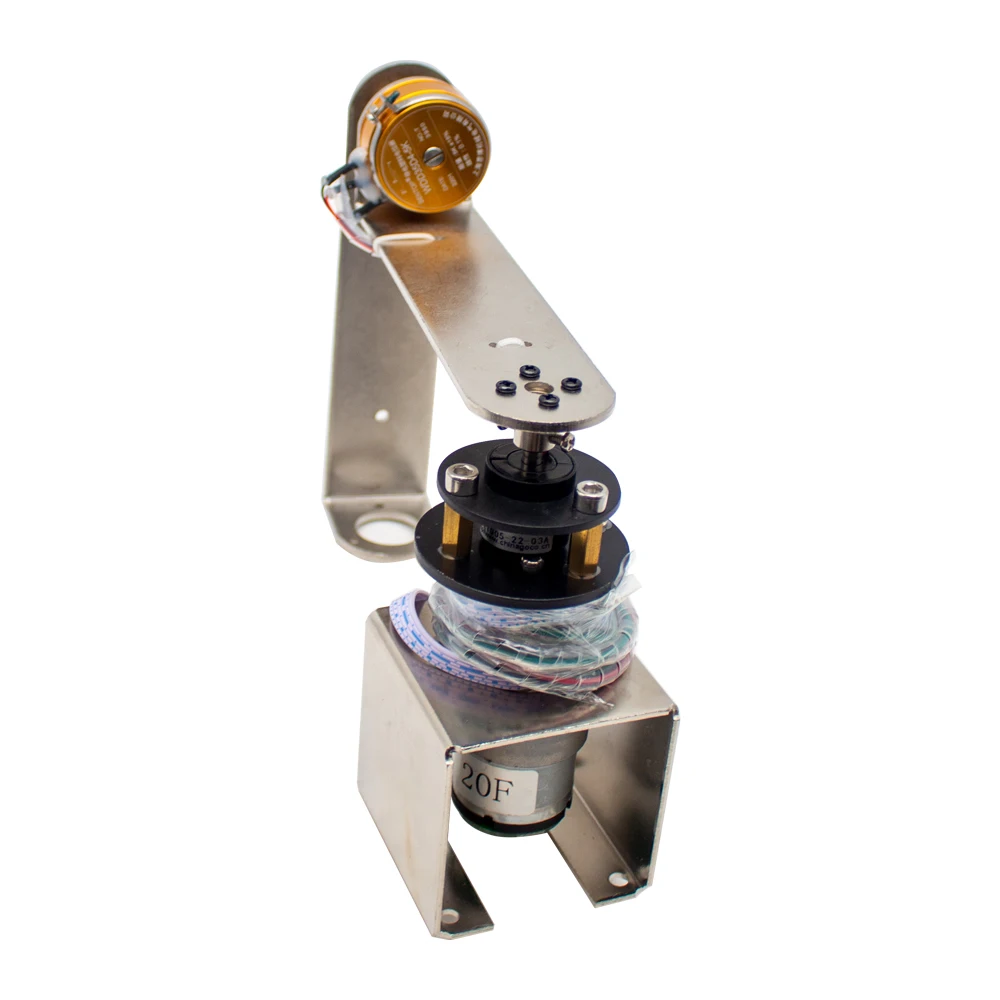

# Rotary Inverted Pendulum (Furuta Pendulum) Control System

  

## Project Overview

This repository contains the implementation of a control system for a **Rotary Inverted Pendulum** (Furuta Pendulum), a classic nonlinear dynamic system used in control theory and robotics research. The objective of this project is to stabilize the pendulum in its inverted position through a combination of **LQR** and **PD controllers**, using both theoretical modeling and practical experimentation.

## Key Features

- **Mathematical Modeling**: The pendulum dynamics are modeled using the Lagrangian method, accounting for kinetic and potential energy balances. The system is represented in state-space form to facilitate control design. 

    $$
        \left\{ \begin{array}{l}
            \ddot{\theta}=\dfrac{m^2l^2rg}{\lambda}\alpha-\dfrac{K_m K_e (J+ml^2)}{\lambda R}\dot{\theta}+\dfrac{K_m (J+ml^2)}{\lambda R} u_a \\[0.5cm] 
            \ddot{\alpha}=\dfrac{mgl(I+mr^2)}{\lambda}\alpha+\dfrac{mrlK_m K_e}{\lambda R} u_a
        \end{array} \right.
    $$

    $$ \lambda= (IJ+Iml^2+Jmr^2) $$

- **Control Design**: The control system includes:
  - A **Linear Quadratic Regulator (LQR)** designed using MATLAB to balance optimal performance and energy usage.
  - **PD Controllers** used for stabilizing the pendulum and the rotary arm.

- **Simulation**: The system's performance is simulated in MATLAB to analyze its stability and response to perturbations.

- **Hardware Implementation**: The control algorithms are implemented on a **Minibalance Duino (Arduino UNO)**, and sensor data is gathered through encoders for real-time feedback. The control constants were fine-tuned through practical experimentation.

    

## Reverse Engineering

The project involved **reverse-engineering** the provided control code from the commercial pendulum kit. Key discrepancies between the provided code and theoretical design were addressed, with adjustments made to enhance the fidelity of the real-world implementation. This required modifications in data acquisition, control routines, and ensuring compatibility with modern Arduino libraries.

## Implemented Code Overview

The Arduino code for the Rotary Inverted Pendulum control system is responsible for managing the control logic, reading sensor data, and displaying information on an OLED screen. Here are the main components of the code:

- **Pin Definitions**: The code defines pins for the OLED display, motor driver (TB6612), and encoders for measuring angles.
  
- **Libraries**: It utilizes libraries such as `SSD1306` for OLED display handling, `PinChangeInterrupt` for managing pin changes, and `MsTimer2` for timer interrupts.

- **Control Constants**: Key control coefficients (LQR/PD) are specified to tune the system's response for the pendulum and arm stabilization.

- **Initialization**: In the `setup()` function, the OLED display is initialized, motor control pins are set up, and interrupts for the encoders are configured for real-time measurement.

- **Control Loop**: The `control()` function reads the angles from the encoders, computes the control signals based on the current state, and adjusts the motor speed accordingly.

- **OLED Display**: Real-time feedback is provided on the OLED screen, displaying critical parameters such as angles, motor voltage, and other performance metrics.

- **Encoder Reading**: Two interrupt service routines update the arm's measured angle based on encoder signals, ensuring accurate tracking of its position.

- **Motor Control**: The `Set_Pwm()` function manages the motor's speed and direction, while `Turn_Off()` ensures the motor stops when the pendulum deviates significantly from its upright position.

This code enables effective control and monitoring of the Rotary Inverted Pendulum, facilitating both theoretical analysis and practical implementation.

## Results

The implemented control system successfully stabilizes the pendulum close to its upright position. Although the practical results deviated slightly from the simulation due to modeling inaccuracies and hardware constraints, the control system responds well to disturbances, maintaining acceptable performance.

## Project Structure

- `/matlab`: MATLAB files for system modeling, controller design, and simulation.
- `/arduino`: Arduino code for implementing the control system.
- `/manuals`: Documentation for hardware setup and data acquisition using PLX-DAQ.
- `/docs`: Project report, including detailed mathematical modeling, control design, and practical results. **All documents are in Spanish**.

## Project Documents (Spanish)

Please note that the main project report and documentation are in **Spanish**. This includes the theoretical model, control design, and detailed explanations of the results.

## Conclusion and Recommendations

Further improvements could be made by refining the system model to match real-world conditions more closely, improving the accuracy of encoder measurements, and considering physical wear in long-term use.

**Authors**: \
Sebastián Palacio Betancur  
Mariana Hernández Beltrán   
**Institution**: Universidad Nacional de Colombia  
**Date**: September 2023 